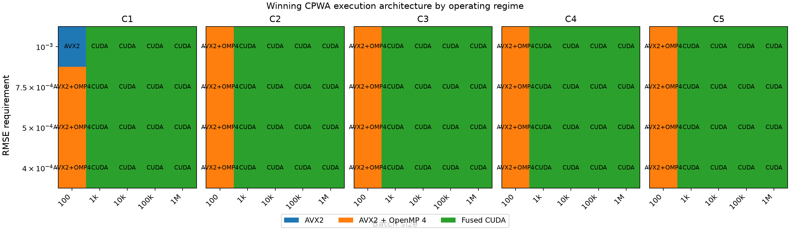
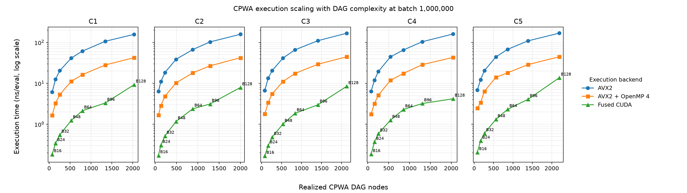
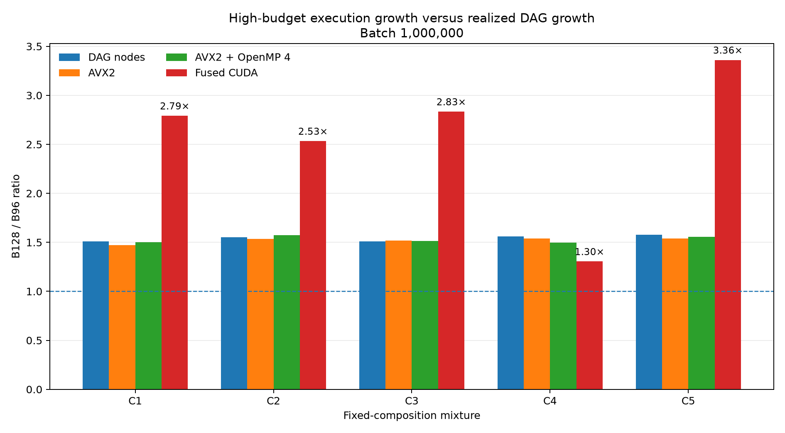
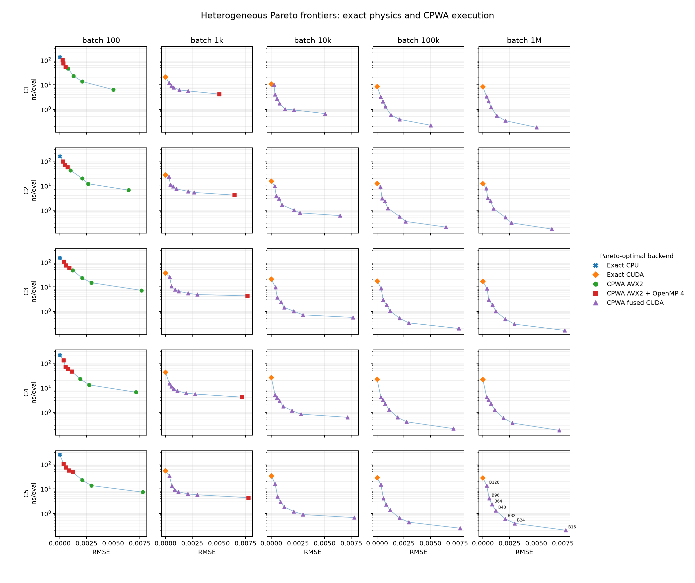

# Fixed-Composition Multicomponent EOS — Heterogeneous Execution Extension

## Executive result

The frozen Case Study 2 v1 release established that fixed-composition CPWA surrogates become increasingly valuable as direct multicomponent Peng-Robinson EOS work becomes more expensive while the surrogate input dimension remains fixed at `(T, P)`. This post-v1 extension asks the next question: **where should the same surrogate execute?**

Native AVX2, AVX2+OpenMP4, and fused CUDA measurements show that execution architecture is itself an operating-point decision. At batch 100, a CPU CPWA backend is fastest for all 35 measured mixture/budget combinations. At batch 1,000, CUDA is fastest for 30/35, while AVX2+OpenMP4 retains the five B16 cases. From batch 10,000 through 1,000,000, CUDA is fastest for all 35 measured CPWA artifacts at each batch.

The extension also resolves the high-budget question raised by v1. Native CPU cost continues to scale approximately with realized DAG node count from B96 to B128, while fused CUDA is superlinear for C1, C2, C3, and C5. The measured evidence therefore shows that the CUDA high-budget cliff is **not an intrinsic consequence of increasing CPWA DAG size**. In the measured CUDA implementation, the superlinear cases coincide with high register pressure and increased spilling, but C4 is a counterexample to any claim that spilling alone determines the slowdown.

Finally, approximation does not automatically dominate exact physics at the largest workloads. C1/B128 is slower than the best exact implementation at three measured batches (1,000, 100,000, and 1,000,000). Thus the engineering decision is joint: required accuracy, batch size, physical-model complexity, surrogate complexity, and execution backend all matter.

## Relationship to the frozen v1 study

The tag `thermogpu-fixed-mixture-v1` and its report remain historical, frozen artifacts. This extension is additive. It reuses the v1 exact and fused-CUDA surrogate evidence and adds retained native-CPU CPWA execution evidence. It does not reinterpret the v1 measurements as if the newer execution backends had been available when v1 was frozen.

The mathematical CPWA artifact is held fixed when AVX2, AVX2+OpenMP4, and CUDA are compared at a given `(mixture, budget, batch)`. Approximation error is therefore identical across those three execution choices; no interpolation or accuracy matching is required.

## Added native CPU evidence

The retained native-CPU sweep contains 350 timing rows: five mixtures, seven TDAR budgets, five common batches (100 through 1,000,000), and two execution policies. The policies are explicit AVX2 and explicit AVX2 with OpenMP using four threads. The generated code uses the same optimized CPWA DAG and liveness schedule used for hardware execution comparisons.

Native CPU evidence provenance records CPWA-ReLU commit `d4ac304b3656fa2848994960922b3193cb45ca60` (`v0.2.0-3-gd4ac304`) and compiler flags `-O3 -march=native -fopenmp -std=c++17`.

## Batch-dependent CPWA architecture crossover

Across all 175 common CPWA operating points, the fastest execution backend is:

| Backend | Wins |
|---|---:|
| AVX2 | 18 |
| AVX2 + OpenMP4 | 22 |
| Fused CUDA | 135 |

The batch-conditioned breakdown is:

| Batch | AVX2 wins | AVX2+OMP4 wins | CUDA wins |
|---:|---:|---:|---:|
| 100 | 18 | 17 | 0 |
| 1,000 | 0 | 5 | 30 |
| 10,000 | 0 | 0 | 35 |
| 100,000 | 0 | 0 | 35 |
| 1,000,000 | 0 | 0 | 35 |

For all 20 equal-accuracy `(mixture, RMSE-target)` comparisons, the largest measured batch at which a CPU CPWA backend beats CUDA is 100 and the smallest measured batch at which CUDA beats the CPU CPWA choices is 1,000. This is a measured bracket, not an interpolated crossover location.

## Surrogate cost follows realized DAG complexity on CPU

At batch 1,000,000, native AVX2 and AVX2+OpenMP4 costs grow approximately in proportion to realized DAG size across the budget sweep. Component count does not directly determine surrogate execution cost: it affects cost only through the realized approximation artifact.

This is especially clear at B128. C1 contains 2,031 DAG nodes and costs about 42.39 ns/eval with AVX2+OpenMP4; C5 contains 2,193 nodes and costs about 44.73 ns/eval. The physical model has grown from one to five components, but the measured CPU surrogate cost rises only modestly because the realized DAGs remain similar in size.

## High-budget backend scaling

The B96-to-B128 transition separates intrinsic representation growth from backend-specific execution behavior:

| Mixture | Node ratio | AVX2 ratio | OMP4 ratio | CUDA ratio | CUDA/node ratio | Spill B96→B128 |
|---|---:|---:|---:|---:|---:|---:|
| C1 | 1.510 | 1.473 | 1.502 | 2.791 | 1.848 | 8→676 |
| C2 | 1.553 | 1.537 | 1.575 | 2.533 | 1.631 | 0→564 |
| C3 | 1.508 | 1.518 | 1.516 | 2.833 | 1.878 | 48→420 |
| C4 | 1.562 | 1.539 | 1.496 | 1.304 | 0.835 | 0→124 |
| C5 | 1.578 | 1.540 | 1.554 | 3.360 | 2.130 | 156→724 |

CPU ratios remain close to node-count growth for every mixture. CUDA is strongly superlinear for C1, C2, C3, and C5, but C4 is not. This establishes that increasing DAG size alone does not force the high-budget cliff. The CUDA resource metrics correlate with the superlinear cases, but the available evidence does not isolate register spilling as the sole cause.

## Heterogeneous Pareto result

The extension constructs 25 heterogeneous Pareto problems: five mixtures times the five batches common to all execution backends. Each problem contains seven exact candidates and 21 surrogate candidates (seven budgets across three CPWA execution backends), for 28 candidates per operating condition. Batch remains an operating condition and is never optimized across.

Separate execution-family frontiers are retained for exact scalar CPU, exact OpenMP, CPWA AVX2, CPWA AVX2+OpenMP4, exact resident CUDA, and CPWA fused CUDA. The global heterogeneous frontier is then the lower envelope of those family frontiers. This makes architecture changes visible without discarding dominated family curves.

The 25 individual plots in `figures/heterogeneous-pareto/` provide the detailed mixture-by-batch view.

## When exact physics re-enters the optimum

When exact physics is allowed to satisfy any positive surrogate-error tolerance because its error is zero, it is the fastest admissible implementation at only three of the 175 measured `(mixture, batch, budget)` comparisons:

| Mixture | Batch | Budget | RMSE | Best CPWA ns/eval | Best exact ns/eval | CPWA/exact speedup |
|---|---:|---:|---:|---:|---:|---:|
| C1 | 1,000 | B128 | 0.000258287 | 22.752 | 20.882 | 0.918× |
| C1 | 100,000 | B128 | 0.000258287 | 9.351 | 8.580 | 0.918× |
| C1 | 1,000,000 | B128 | 0.000258287 | 9.257 | 8.349 | 0.902× |

All three occur for C1/B128. The result is important precisely because it is not monotone: even at very large batch, a sufficiently complex high-accuracy surrogate can become slower than the exact calculation it approximates.

## Engineering interpretation

The extension changes the implementation question from a binary choice between exact physics and approximation into a heterogeneous optimization problem. The preferred implementation is the lowest-cost admissible point subject to the required accuracy and the actual workload. Physical-model complexity controls the cost of exact evaluation; realized DAG complexity controls much of the CPWA cost; batch size controls whether CPU or GPU execution amortizes best; and backend resource behavior can make the highest-accuracy surrogate uneconomic.

A practical deployment policy should therefore select both **surrogate budget** and **execution backend** rather than treating either as fixed. The measured frontiers are the appropriate decision object for that selection.

## Limitations

- Native CPU surrogate evidence begins at batch 100, so heterogeneous conclusions do not cover batches 1 or 10.
- Composition remains fixed and the surrogate input space remains two-dimensional `(T, P)`.
- The C1-C5 engineering progression changes species identity as well as component count.
- Binary interaction coefficients are zero.
- The surrogate predicts only `Z`; the exact EOS implementation computes richer thermodynamic output, so timing ratios are not a like-for-like output-scope comparison.
- Results describe one measured hardware/software environment.
- CPU and CUDA implementations use different execution machinery; the experiment isolates observed backend behavior but does not prove a unique microarchitectural cause.
- The CUDA spill/resource correlation is observational; C4 demonstrates that spilling alone is not a sufficient explanation of the B128 slowdown.

## Reproduction and provenance

The extension is evidence-only reproducible. The reproduction pipeline verifies the frozen v1 raw evidence, validates the retained native-CPU evidence structure, rebuilds the original v1 derived artifacts, then deterministically reconstructs the heterogeneous analyses, figures, execution-family comparison, and this extension report. It does not rerun ThermoGPU, TDAR, CPWA synthesis, native CPU benchmarking, or CUDA benchmarking.

The frozen v1 report remains `reports/thermogpu-fixed-mixture-v1.md`; this file documents only the additive post-v1 execution study.
