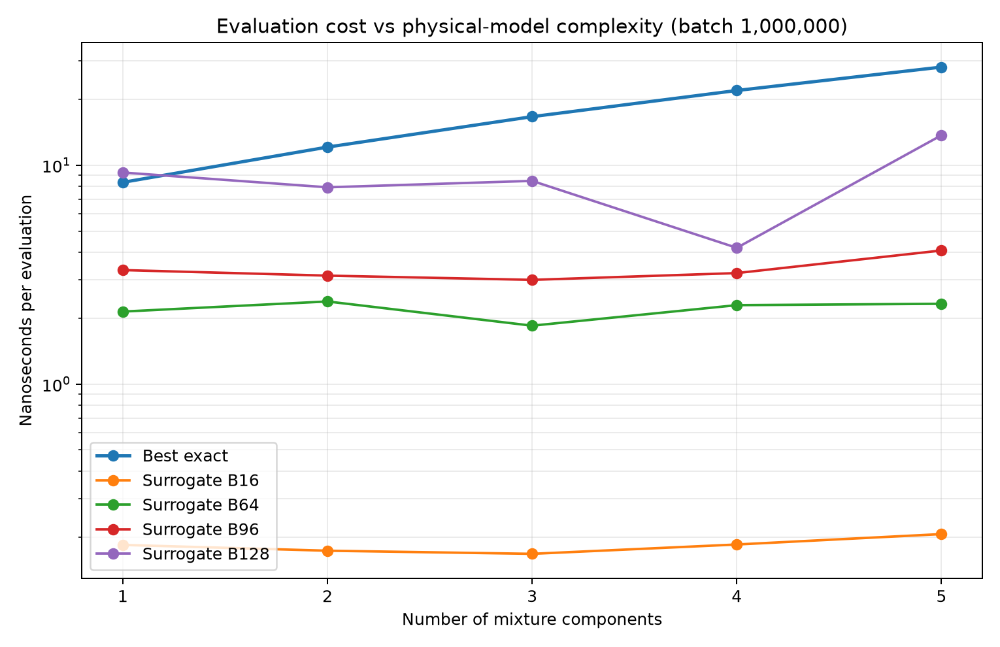
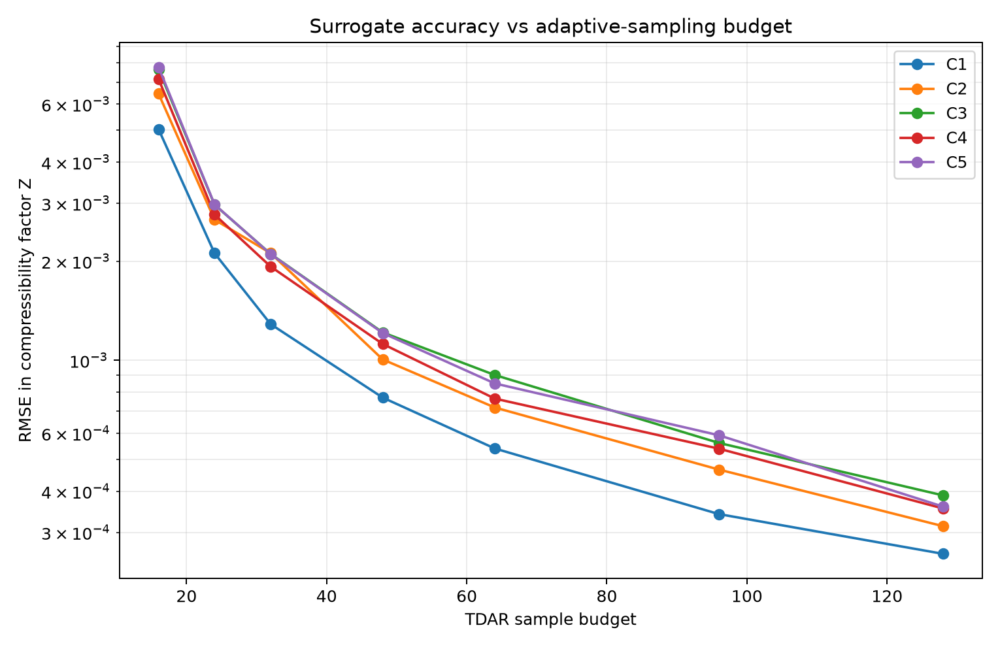
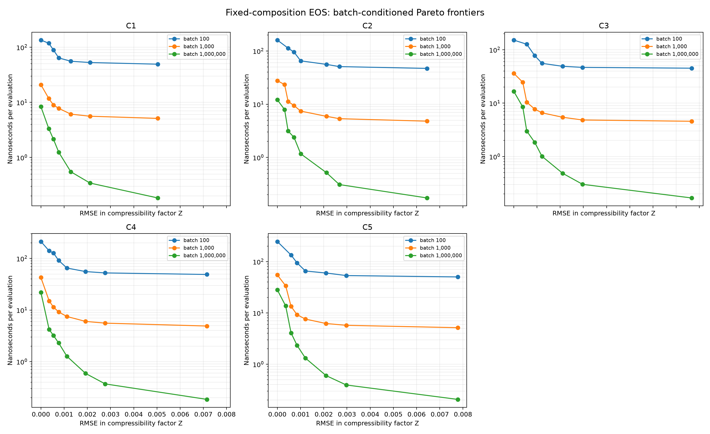
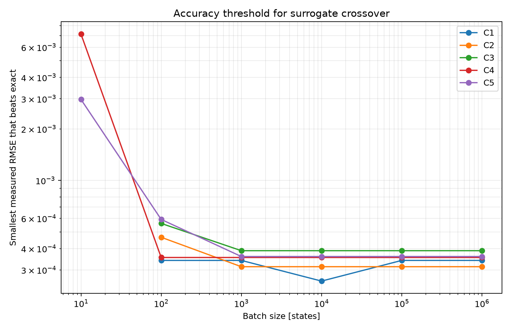
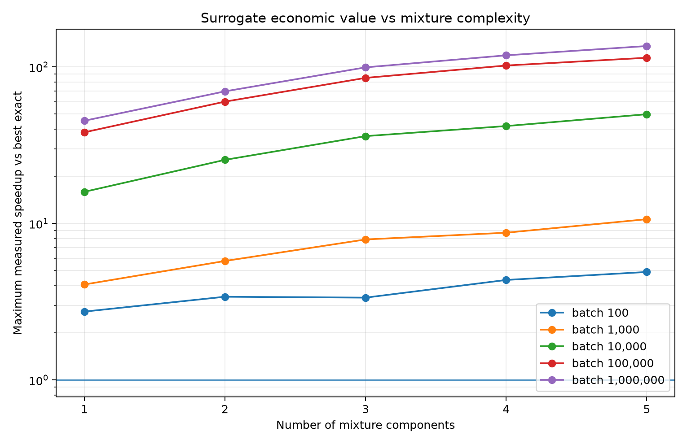
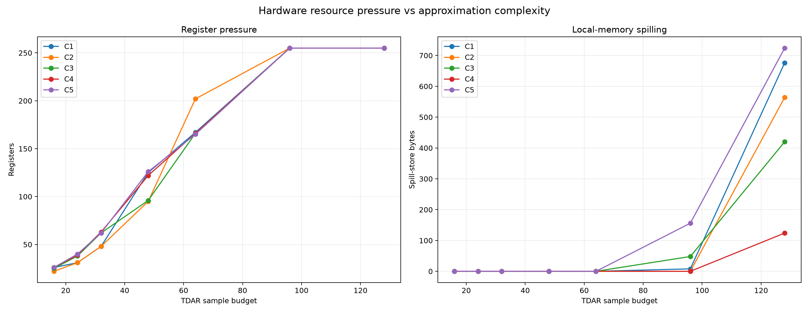

# ThermoGPU Fixed-Composition Multicomponent EOS Engineering Surrogate Case Study

> Generated from retained case-study evidence. Measured values and conclusions are derived; do not edit them by hand.

## Executive result

This study asks when approximation becomes cheaper than direct physics for fixed-composition Peng–Robinson mixture EOS evaluation while the surrogate input dimension remains fixed at `(T, P)`.

Unlike Case Study 1, the answer is **yes, conditionally**. Exact physics remains preferable at very small workloads, but hardware-executable CPWA surrogates become Pareto-optimal as batch size grows. By batch 100, at least one measured surrogate is faster than the best exact implementation for every C1-C5 mixture.

At batch 1,000,000, the maximum measured surrogate speedup rises from **45.35× for C1** to **136.06× for C5**. The central engineering result is therefore that increasing physical-model complexity can increase the economic value of approximation when surrogate input dimension remains fixed.

A second crossover occurs within the surrogate family: increasing accuracy eventually creates substantial GPU resource pressure. The B96-to-B128 transition reaches 255 registers for all mixtures and is accompanied by sharply increased spilling and a high-accuracy execution-cost penalty.

## Scope and frozen design

The study covers fixed-composition compressibility-factor `Z` over 250-350 K and 1-10 MPa. Binary interaction coefficients are zero. Each surrogate has only two inputs, temperature and pressure.

The nested engineering mixture family is:

| Case | Components |
|---|---|
| C1 | methane |
| C2 | methane + ethane |
| C3 | methane + ethane + propane |
| C4 | methane + ethane + propane + nitrogen |
| C5 | methane + ethane + propane + nitrogen + carbon dioxide |

C5 mole fractions are 0.80 methane, 0.08 ethane, and 0.04 each propane, nitrogen, and carbon dioxide. C1-C4 retain the corresponding prefix and renormalize it. Consequently, C1-C5 changes species identity as well as component count and is an engineering progression rather than a controlled component-count-only experiment.

TDAR budgets are 16, 24, 32, 48, 64, 96, and 128 points. Accuracy is measured on 10,000 frozen Sobol validation states using seed 20261002. Performance batches are 1, 10, 100, 1,000, 10,000, 100,000, and 1,000,000 states.

## Frozen provenance

| Evidence | Version / commit |
|---|---|
| ThermoGPU base | `v1.1.0` / `180bbcb0eb70747037013dc3ea44032e10185f74` |
| Exact-scaling evidence | `e233f02` |
| Complete surrogate hardware evidence | `1c95ebc` |
| CPWA-ReLU | `v0.2.0` / `6ac34968992ae17c079f92ba37c0deacd5b69a19` |

The retained evidence consists of eight checksum-verified files. ThermoGPU passed 9/9 tests after evidence acquisition.

## Exact implementation crossover

Across all five mixtures, the broad workload crossover is consistent: scalar CPU execution is preferred at batches 1 and 10, OpenMP becomes preferred around batch 100, and resident CUDA becomes preferred from batch 1,000 onward. Small differences between the generic and fixed-composition resident CUDA paths are not interpreted strongly.

At batch 1,000,000 the best exact cost is:

| Mixture | Best exact ns/eval |
|---|---:|
| C1 | 8.349 |
| C2 | 12.098 |
| C3 | 16.664 |
| C4 | 21.941 |
| C5 | 28.070 |

The best exact cost therefore rises from 8.349 ns/eval for C1 to 28.070 ns/eval for C5 on this workload.



## Approximation geometry and accuracy

At budget 128 the approximation geometry remains remarkably similar across the five mixtures:

| Mixture | Simplices | DAG nodes | RMSE |
|---|---:|---:|---:|
| C1 | 221 | 2031 | 0.000258287 |
| C2 | 225 | 1999 | 0.000313377 |
| C3 | 223 | 2130 | 0.000388704 |
| C4 | 224 | 2043 | 0.000354737 |
| C5 | 225 | 2193 | 0.000359343 |

The simplex counts remain in the narrow range 221-225. Thus, for this fixed two-dimensional input space, increasing mixture complexity does not produce a corresponding increase in measured simplicial geometry.



## Performance and batch-conditioned Pareto result

Batch size is an operating condition, not a Pareto objective. The study therefore constructs 35 independent Pareto problems: five mixtures times seven batch sizes. Each minimizes validation RMSE and ns/evaluation. Exact implementations have RMSE exactly zero; no artificial epsilon is introduced.

At batch 1, no measured surrogate is Pareto-optimal for any mixture. C4 and C5 have nominal measured crossovers at batch 10, but their advantages are only about 2-3 percent and should not be given strong engineering interpretation because the direct and surrogate timing harnesses are not identical. By batch 100, every mixture has at least one measured surrogate faster than its best exact implementation.

The first measured crossover for each mixture is:

| Mixture | Batch | Budget | RMSE | Speedup |
|---|---:|---:|---:|---:|
| C1 | 100 | 96 | 0.000341042 | 1.14× |
| C2 | 100 | 96 | 0.000465626 | 1.42× |
| C3 | 100 | 96 | 0.00056098 | 1.20× |
| C4 | 10 | 16 | 0.00715352 | 1.03× |
| C5 | 10 | 24 | 0.00297182 | 1.02× |





## Throughput regime

At batch 1,000,000, the most accurate measured surrogate that remains faster than exact and the maximum available speedup are:

| Mixture | Best exact ns/eval | Most accurate faster budget | RMSE | Speedup | Maximum speedup |
|---|---:|---:|---:|---:|---:|
| C1 | 8.349 | 96 | 0.000341042 | 2.52× | 45.35× |
| C2 | 12.098 | 128 | 0.000313377 | 1.53× | 69.86× |
| C3 | 16.664 | 128 | 0.000388704 | 1.97× | 99.44× |
| C4 | 21.941 | 128 | 0.000354737 | 5.23× | 118.67× |
| C5 | 28.070 | 128 | 0.000359343 | 2.05× | 136.06× |

The lowest-budget B16 kernels are extremely fast but relatively inaccurate. More useful engineering operating points retain meaningful speedups at substantially lower error. At batch 1,000,000, for example, the B64 surrogate cost remains nearly independent of mixture complexity:

| Mixture | B64 ns/eval |
|---|---:|
| C1 | 2.144 |
| C2 | 2.384 |
| C3 | 1.848 |
| C4 | 2.293 |
| C5 | 2.327 |

This contrasts with the rising exact EOS cost and explains the increasing economic value of approximation across the engineering mixture progression.



## High-accuracy hardware resource boundary

The B96-to-B128 transition reveals a second engineering crossover. All five B96 and B128 kernels use 255 registers, while B128 sharply increases spill and stack requirements:

| Mixture | RMSE B96 | RMSE B128 | Spill B96 | Spill B128 | Stack B96 | Stack B128 |
|---|---:|---:|---:|---:|---:|---:|
| C1 | 0.000341042 | 0.000258287 | 8 | 676 | 8 | 680 |
| C2 | 0.000465626 | 0.000313377 | 0 | 564 | 0 | 568 |
| C3 | 0.00056098 | 0.000388704 | 48 | 420 | 48 | 424 |
| C4 | 0.000538851 | 0.000354737 | 0 | 124 | 0 | 128 |
| C5 | 0.000591867 | 0.000359343 | 156 | 724 | 160 | 728 |

The additional B128 accuracy is therefore accompanied by a disproportionate execution-cost increase. The measured spilling is strongly associated with this slowdown, but this study does not establish spilling as its sole causal mechanism.



## Engineering interpretation

Case Study 2 identifies two distinct crossovers.

First, there is a **physics-to-surrogate workload crossover**. At small batches, launch and execution overhead make direct physics preferable. As workload increases, surrogate execution becomes competitive and then substantially faster. Because direct mixture-EOS cost rises across C1-C5 while the two-dimensional surrogate cost remains comparatively insensitive to mixture complexity, the economic value of approximation increases.

Second, there is an **accuracy-to-resource crossover within the surrogate family**. Increasing approximation budget improves accuracy, but sufficiently complex generated kernels encounter GPU resource pressure. The most accurate surrogate is therefore not automatically the best engineering operating point.

The practical choice is jointly conditioned on required accuracy, workload size, physical-model complexity, and generated-kernel execution cost.

## Limitations

Composition is fixed during each surrogate evaluation, and the surrogate predicts only `Z`; the exact EOS path computes a richer thermodynamic result. Binary interaction coefficients are zero. The C1-C5 family changes species identity as well as component count. The domain is limited to 250-350 K and 1-10 MPa. Equal-accuracy conclusions use measured TDAR budgets without interpolation.

Direct and surrogate measurements both characterize warm resident execution but use different timing harnesses, so tiny percentage differences should not be overinterpreted. Results represent one hardware/software environment.

The study does not establish asymptotic scaling and should not be generalized directly to variable-composition EOS surrogates. A variable-composition problem changes the surrogate input dimension and is a separate experiment.

## Reproduction

The retained raw evidence is immutable and checksum-verified. All processed datasets, Pareto classifications, engineering synthesis, publication figures, and this report can be regenerated without rerunning TDAR sampling, CPWA synthesis, ThermoGPU evidence acquisition, or CUDA benchmarking:

```bash
python3 case-studies/thermogpu-fixed-mixture/scripts/run_study.py --reproduce
```

Reproduction mode validates the eight retained evidence files before deleting or rebuilding any derived artifact.
