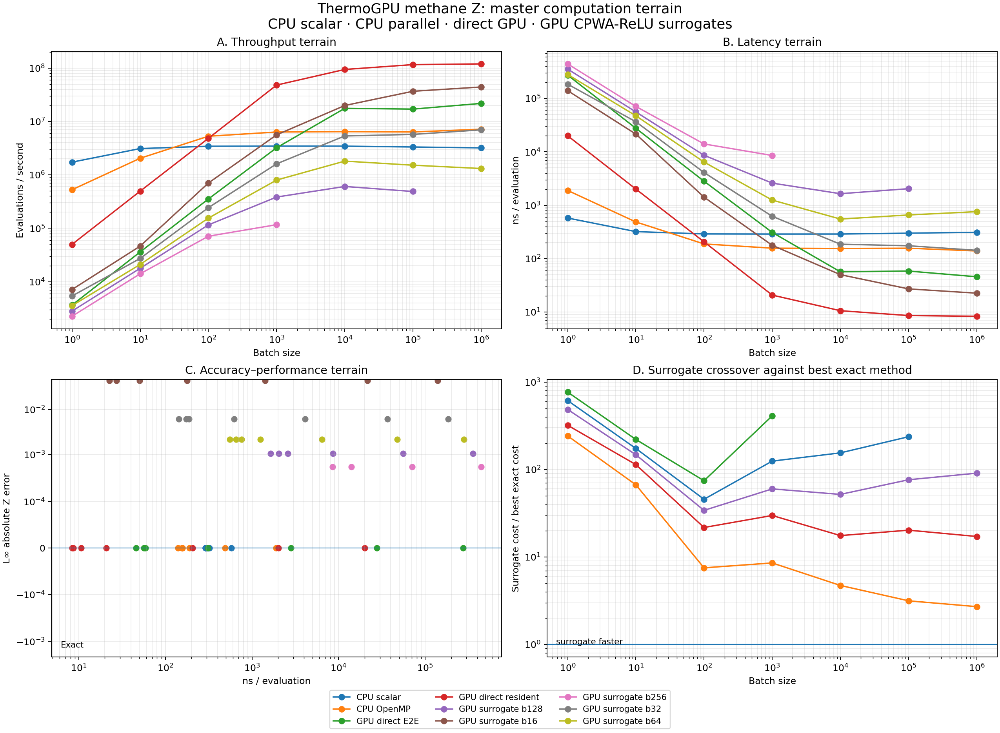
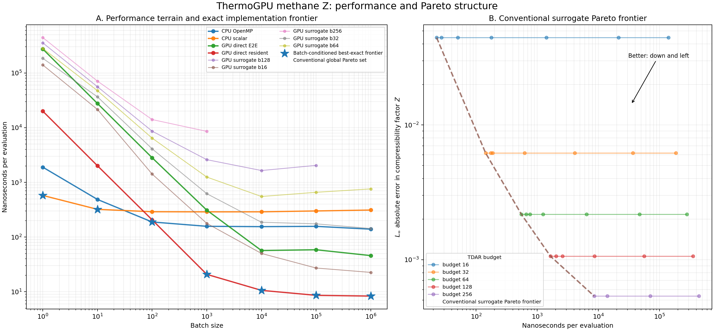
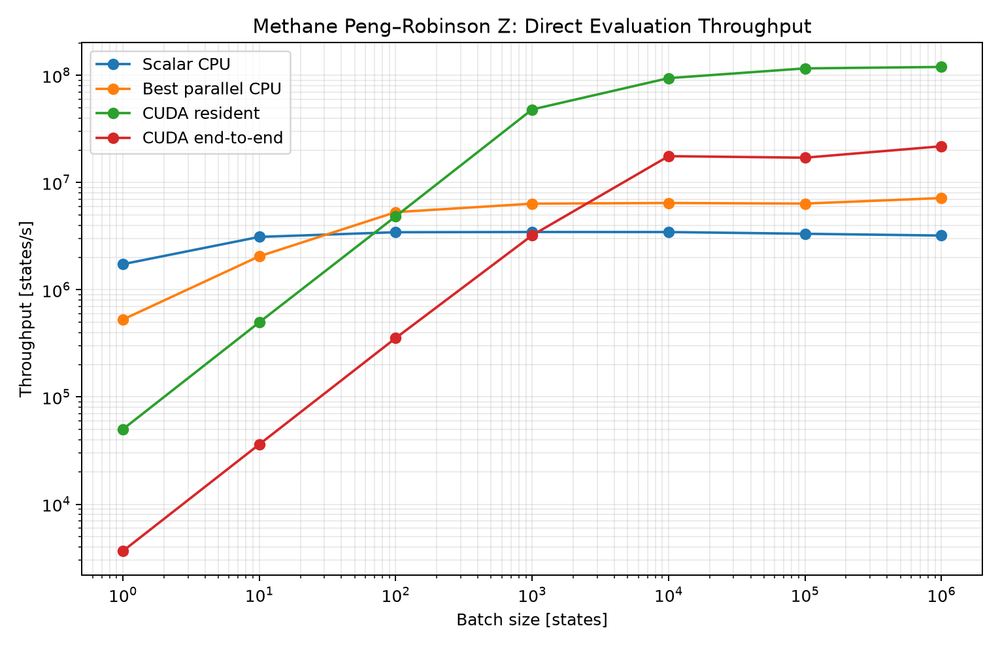
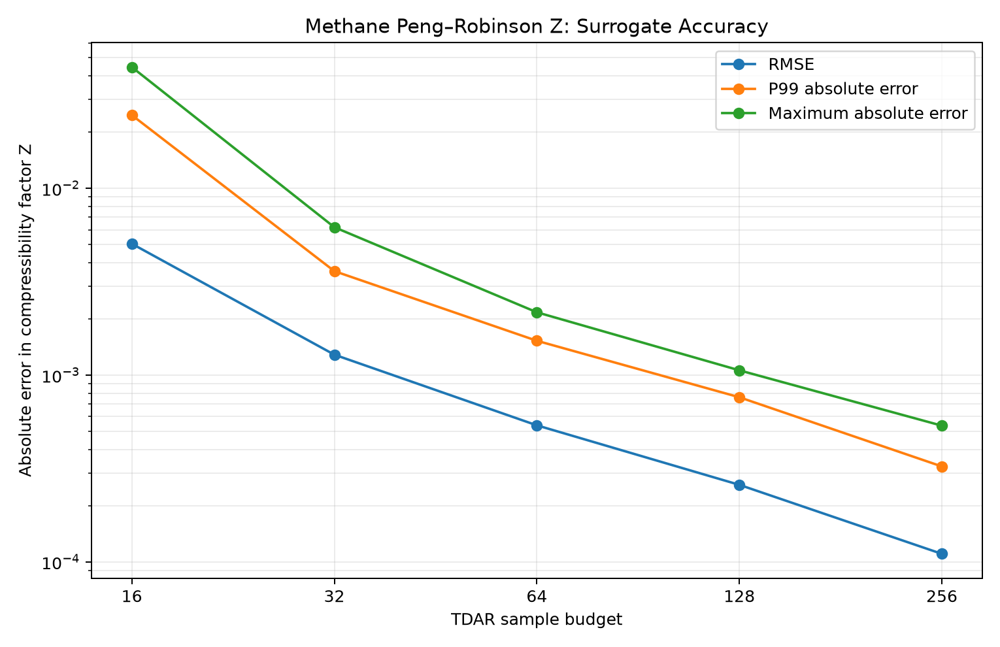

# ThermoGPU Methane-Z Engineering Surrogate Case Study

> Generated from retained case-study evidence. Measured values and conclusions are derived; do not edit them by hand.

## Executive result

This V1 study tested whether an adaptively constructed TDAR simplicial CPWA surrogate, compiled to an exact CPWA-ReLU DAG and executed on the GPU, provides a computational advantage over direct Peng–Robinson methane compressibility-factor evaluation on the tested hardware and workload range.

It did not. All **31** measured surrogate operating points were dominated by the fastest exact method at the same batch size, and **0** surrogate points appeared on the conventional global speed/error Pareto frontier. The result is therefore a negative performance result for this measured case, not a claim that CPWA surrogates are generally ineffective.

## Scope and frozen design

The study compares direct methane-Z evaluation with the pipeline **TDAR → simplicial CPWA → exact CPWA-ReLU DAG → GPU execution**. Surrogate budgets are 16, 32, 64, 128, and 256 points; benchmark batches are 1, 10, 100, 1,000, 10,000, 100,000, and 1,000,000 states. Accuracy is evaluated against the frozen common validation set.

The interpretation is empirical and restricted to the tested ThermoGPU methane-Z problem, domain, surrogate construction, execution policies, hardware, budgets, batches, and accuracy range. Fitted power-law exponents below describe measured-range trends; they are not asymptotic complexity theorems.

## Frozen provenance

| Repository | Version | Commit | Dirty |
|---|---|---|---|
| ThermoGPU | v1.1.0 | `180bbcb0eb70` | False |
| TDAR | v0.3.0 | `527144927bda` | False |
| CPWA-ReLU | v0.2.0 | `6ac34968992a` | False |
| case-study | thermogpu-spec-v1-1-gf83f38f | `f83f38f07ed5` | True |

## Exact implementation crossover

The preferred exact implementation changes with workload size:

| Batch | Preferred exact method | ns/eval | Runner-up | Speedup vs runner-up |
|---:|---|---:|---|---:|
| 1 | CPU scalar | 577.1 | CPU OpenMP | 3.284× |
| 10 | CPU scalar | 321.3 | CPU OpenMP | 1.517× |
| 100 | CPU OpenMP | 188.8 | GPU direct resident | 1.095× |
| 1,000 | GPU direct resident | 20.82 | CPU OpenMP | 7.557× |
| 10,000 | GPU direct resident | 10.62 | GPU direct E2E | 5.342× |
| 100,000 | GPU direct resident | 8.615 | GPU direct E2E | 6.806× |
| 1,000,000 | GPU direct resident | 8.353 | GPU direct E2E | 5.492× |

Scalar CPU is best at batches 1 and 10, OpenMP at 100, and resident direct GPU evaluation from batch 1,000 onward. At batch 1,000,000 the resident direct GPU reaches approximately 119.7 million evaluations/s.

## Surrogate accuracy and representation growth

| Budget | Simplices | Total DAG nodes | RMSE | p99 abs. error | L∞ error |
|---:|---:|---:|---:|---:|---:|
| 16 | 26 | 101 | 0.005051 | 0.02466 | 0.04457 |
| 32 | 52 | 462 | 0.001287 | 0.003605 | 0.006192 |
| 64 | 108 | 1826 | 0.0005389 | 0.001528 | 0.002171 |
| 128 | 221 | 6383 | 0.0002588 | 0.0007616 | 0.001061 |
| 256 | 464 | 24706 | 0.0001106 | 0.0003247 | 0.0005366 |

Across the five measured budgets, simplices scale approximately as budget^1.04, while total DAG nodes scale approximately as budget^1.966. L∞ error scales approximately as budget^-1.53. Thus accuracy improves materially, but the exact DAG representation grows substantially faster than the simplex count.

Measured steady-state execution time scales approximately as total_nodes^0.6741 and as L∞^-0.8245 over this range. These are empirical fits only.

## Performance and Pareto result

The unified terrain contains **31** measured surrogate operating points. **31/31** are dominated by the best exact method at the same batch size. The conventional global Pareto set contains **0** surrogate points.

This means the surrogate does not buy speed in exchange for approximation error in the measured regime: an exact implementation is already faster at every directly compared workload size.





## Feasibility boundary and measurement sufficiency

The frozen 5 × 7 design contains 35 surrogate cells: **31 complete**, **1 documented resource failure**, and **3 explicitly deferred**.

Budget 128 at batch 1,000,000 failed because of `gpu_memory` on `gpu:cuda:0`; the retained failure record is `case-studies/thermogpu/raw-results/surrogate-performance/budget-128/calibration/float32-b1000000.failed.json`.

The deliberately deferred cells are B256×10,000, B256×100,000, B256×1,000,000. They were not required to establish the V1 conclusion because every measured surrogate point was already dominated, no surrogate was globally Pareto-optimal, and no unclassified pending cells remained.

Measurement sufficiency for the current V1 conclusion: **yes**. Additional measurements required for that conclusion: **no**.

## Engineering interpretation

The principal engineering result is that the direct evaluator is already sufficiently efficient that replacing it with this exact CPWA-ReLU realization does not reduce evaluation cost. Increasing surrogate accuracy increases simplicial and DAG complexity, and the execution cost rises enough to erase the usual motivation for a surrogate.

The negative result is useful because it identifies where future work should focus: not on assuming that approximation is faster, but on measuring the complete representation-and-execution chain and comparing it against the best workload-conditioned exact implementation. A different thermodynamic problem, dimensionality, hardware target, surrogate representation, or execution strategy may produce a different crossover.

## Limitations

V1 studies one methane compressibility-factor map on one measured hardware configuration. It does not establish asymptotic scaling, generalize the measured power-law fits beyond the sampled budgets, or prove that other EOS mixtures, higher-dimensional thermodynamic maps, alternative CPWA constructions, reduced DAG representations, accelerators, or execution policies cannot benefit from surrogates. The B256 large-batch cells were deliberately deferred after the V1 conclusion became measurement-sufficient.

## Supporting figures





## Reproduction

The scientific results, publication figures, analyses, and this report can be regenerated from retained experimental evidence without rerunning expensive evidence-producing GPU experiments:

```bash
/nvme/Sync/cpwa-relu/.venv/bin/python \
  case-studies/thermogpu/scripts/run_study.py \
  --config case-studies/thermogpu/configs/study-v1.toml \
  --reproduce
```

In reproduction mode, evidence-producing stages are retained and validated; derived processing, figures, Pareto construction, analysis, and report generation are rerun. Legacy surrogate-performance aggregate stages are intentionally omitted because the authoritative V1 performance analysis consumes the retained per-cell calibration evidence directly.
